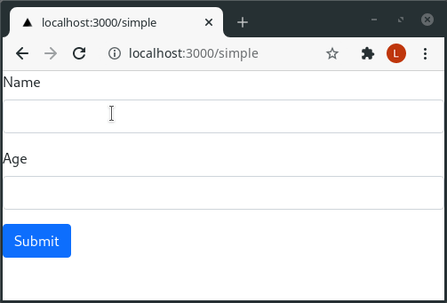

# React Forms

React forms is a simple form creation library which:

- automatically generates forms,
- automatically generates fields for custom layout,
- validates forms,
- supports field customisations such as disabled, placeholders, etc,
- supports custom field widgets, and
- is fully typed.

Below is a simple example:

```ts
import React from 'react';
import { render } from 'react-dom';
import * as scrub from '@framed/scrub';
import { Form } from '@framed/forms';

const schema = scrub.object({
  name: scrub.string(),
  age: scrub.number({ min: 18, allowTypes: 'string' }),
});

const App = () => {
  return <Form schema={schema} onValidated={(e) => alert(`Thank you for registering ${e.name}`)} />;
};

render(<App />, document.getElementById('root'));
```

[Edit on StackBlitz](https://stackblitz.com/edit/react-ts-amyort?file=index.tsx)



# Examples

- [Simple Example](https://stackblitz.com/edit/react-ts-amyort?file=index.tsx)
- [Horizontal form with all field types](https://stackblitz.com/edit/react-ts-kgv6k5?file=index.tsx)
- [Custom form layout](https://stackblitz.com/edit/react-ts-ur6dkr?file=index.tsx)
- [Optionally required fields](https://stackblitz.com/edit/react-ts-5trcmf?file=index.tsx)
- [Custom widget](https://stackblitz.com/edit/react-ts-7isqqr?file=index.tsx)

# Documentation

To install run `npm i @framed/forms @framed/scrub`. You will need to be load Bootstrap 5 to render the forms correctly.

## Validation

For validation documentation please refer to [scrub documentation](https://scrub.readthedocs.io/en/latest/).

## Automatic forms

The `Form` component can be used to easily create a form as shown in the example below:

```ts
import React from 'react';
import { render } from 'react-dom';
import * as scrub from '@framed/scrub';
import { Form, form, useForm } from '@framed/forms';

const schema = scrub.object({
  name: scrub.string(),
  age: scrub.number({ min: 18, allowTypes: 'string' }),
});

const App = () => {
  return (
    <Form
      schema={schema}
      onValidated={(e) => alert(`Thank you for registering ${e.name}`)}
      // Uncomment the following line to log validation errors to console
      // onValidationError={(e) => console.error('validation error', e)};

      // Uncomment the following to make the form horizontal
      // horizontal={{ labelClass: "col-sm-2", valueClass: "col-sm-10" }};

      // Uncomment the following to only show the age field
      // fields={["age"]};

      // Uncomment the following to set the default name to Bob Brown
      // defaults={{ name: "Bob Brown" }};

      // Uncomment the following to show validation errors as soon as the field is changed
      // validateFieldEvent="change"

      // Uncomment the following to only update field error messages when the submit button is pressed.
      // validateFieldErrorEvent="submit"
    />
  );
};

render(<App />, document.getElementById('root'));
```

[Edit on StackBlitz](https://stackblitz.com/edit/react-ts-vlkmva?file=index.tsx)

## Custom layouts

To completely customise the layout use the `useForm` function inside a React function controller, as shown below:

```ts
import React from 'react';
import { render } from 'react-dom';
import * as scrub from '@framed/scrub';
import { useForm } from '@framed/forms';

const schema = scrub.object({
  fields: {
    password: scrub.password(),
    confirmPassword: scrub.password(),
  },

  customValidation: (state) => {
    if (state.cleanedFields.password !== state.cleanedFields.confirmPassword) {
      state.addError('Passwords do not match', 'confirmPassword');
    }
  },
});

const App = () => {
  const form = useForm({ schema });

  const validate = (e: React.FormEvent<HTMLFormElement>) => {
    e.preventDefault();
    const result = form.validate();

    // result will be undefined if the form did not validate
    if (result) {
      alert('Form accepted');
    }
  };

  return (
    <div>
      <form noValidate={true} onSubmit={validate}>
        <div className="row">
          <div className="col-sm-6">{form.fields.password()}</div>
          <div className="col-sm-6">{form.fields.confirmPassword()}</div>
        </div>

        <button type="submit" className="btn btn-primary">
          Continue
        </button>
      </form>
    </div>
  );
};

render(<App />, document.getElementById('root'));
```

[Edit on StackBlitz](https://stackblitz.com/edit/react-ts-ur6dkr?file=index.tsx)

Another example of a custom layout is in the example [Optionally required fields](https://stackblitz.com/edit/react-ts-5trcmf?file=index.tsx).

## Field customizations

Fields can be customised when defining a schema or when displaying a field.

```ts
import React from 'react';
import { render } from 'react-dom';
import * as scrub from '@framed/scrub';
import { form, useForm } from '@framed/forms';

const schema = scrub.object({
  formLabel: form({ formLabel: 'Custom label (set when defining the schema)' })(scrub.string({ empty: true })),
  dropDown: form({
    selectFrom: ['First item', 'Second item', 'Third item'],
  })(scrub.string()),
  field: scrub.string({}),
});

const App = () => {
  const form = useForm({ schema });

  const validate = (e: React.FormEvent<HTMLFormElement>) => {
    e.preventDefault();
    const result = form.validate();
    if (result) {
      alert('Form accepted');
    }
  };

  return (
    <div>
      <form noValidate={true} onSubmit={validate}>
        {form.fields.formLabel()}

        {form.fields.field({ formLabel: 'Label defined when adding field' })}
        {form.fields.field({ enabled: false, formLabel: 'Disabled field' })}
        {form.fields.field({
          helpText: 'This will appear under the input',
          formLabel: 'Help text',
        })}

        {form.fields.dropDown({})}

        <div>Just the HTML input field: {form.fields.field({ inputOnly: true })}</div>

        {form.fields.field({ placeholder: 'Placeholder text' })}

        <button type="submit" className="btn btn-primary">
          Continue
        </button>
      </form>
    </div>
  );
};

render(<App />, document.getElementById('root'));
```

[Edit on StackBlitz](https://stackblitz.com/edit/react-ts-7isqqr?file=index.tsx)

## Custom widgets

Inputs can be customised using `customInput` as shown below:

```ts
import React from 'react';
import { render } from 'react-dom';
import * as scrub from '@framed/scrub';
import { useForm } from '@framed/forms';

const schema = scrub.object({
  amount: scrub.number({ min: 1, allowTypes: ['string'] }),
});

const currencyWidget = (props: React.InputHTMLAttributes<HTMLInputElement>) => {
  const isInvalid = /is-invalid/.test(props.className);
  return (
    <div className={`input-group mb-3 ${isInvalid ? 'is-invalid' : ''}`}>
      <span className="input-group-text">$</span>
      <input aria-label="Amount (to the nearest dollar)" {...props} />
      <span className="input-group-text">.00</span>
    </div>
  );
};

const App = () => {
  const form = useForm({ schema });

  const validate = (e: React.FormEvent<HTMLFormElement>) => {
    e.preventDefault();
    const result = form.validate();
    if (result) {
      alert('Form accepted');
    }
  };

  return (
    <div>
      <form noValidate={true} onSubmit={validate}>
        {form.fields.amount({
          customInput: currencyWidget,
        })}

        <button type="submit" className="btn btn-primary">
          Continue
        </button>
      </form>
    </div>
  );
};

render(<App />, document.getElementById('root'));
```

[Edit on StackBlitz](https://stackblitz.com/edit/react-ts-7isqqr?file=index.tsx)

A widget can be also customised by specifying a generator. A generator creates a callback that picks the widget to render from the field. However, generators are not documented.

# Building from source code

To setup the project for the first time run `npm i && npm i --prefix example`.

Once the project is setup `npm run build` will build the project into lib and `npm run dev` will start a webserver on port 3000 for development.
